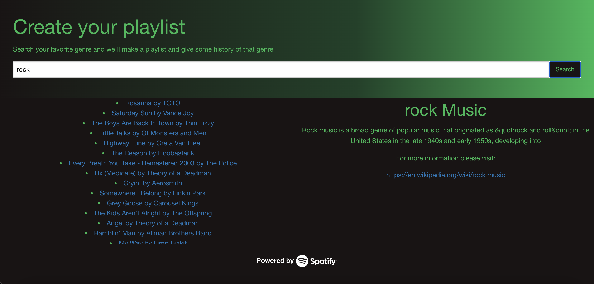

# 🔊 All-in-1 Music

An application to create a Spotify music playlist with information based on your favorite genre

## Features

- Generate a playlist based on selected genre
- Exposure to new music
- Learn about music genre facts while the playlist is generated

## Web API Data

Music data for playlists provided by [Spotify](	https://api.spotify.com/v1/recommendations/available-genre-seeds)

Genre data provided by [Wikipedia](https://en.wikipedia.org/wiki/)

## Deployment

- Repository:

- Live URL:
